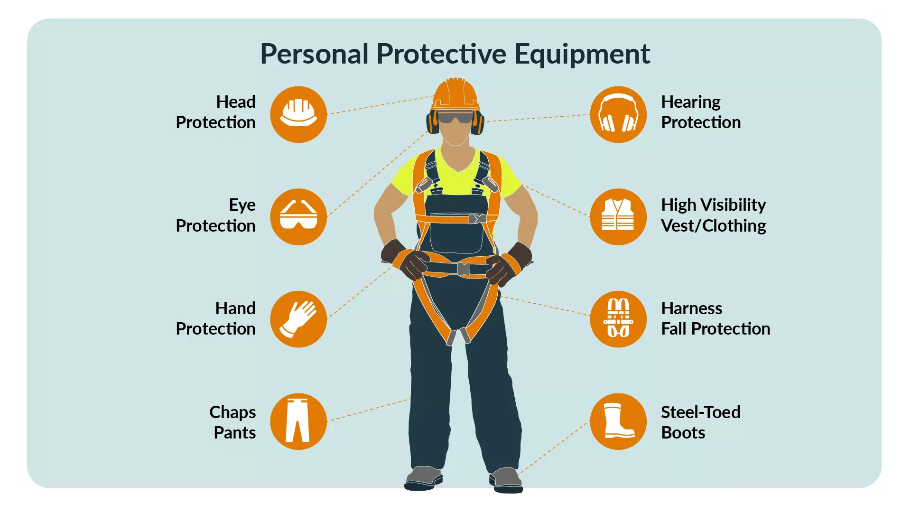
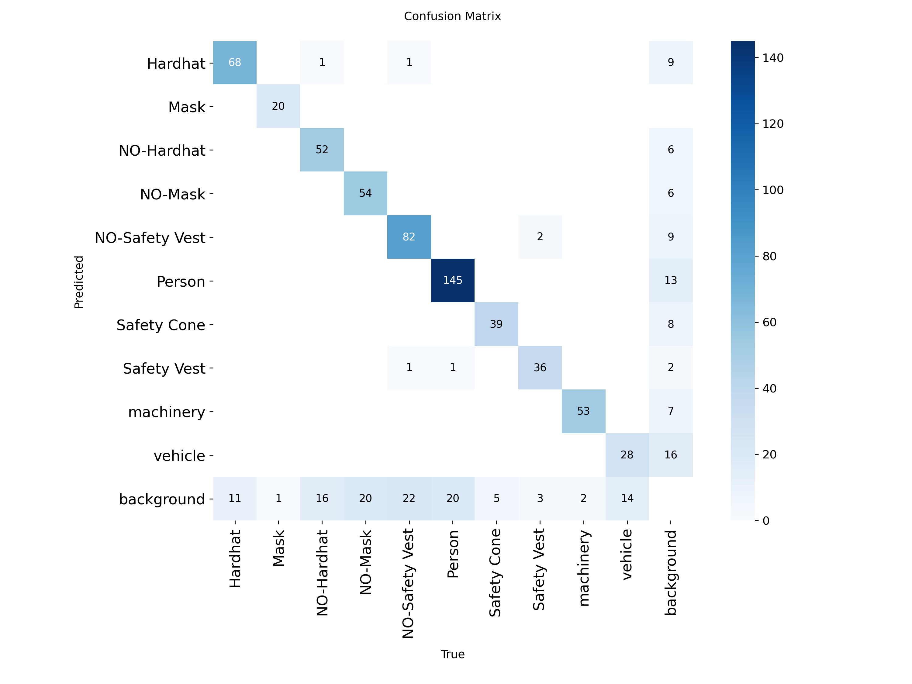
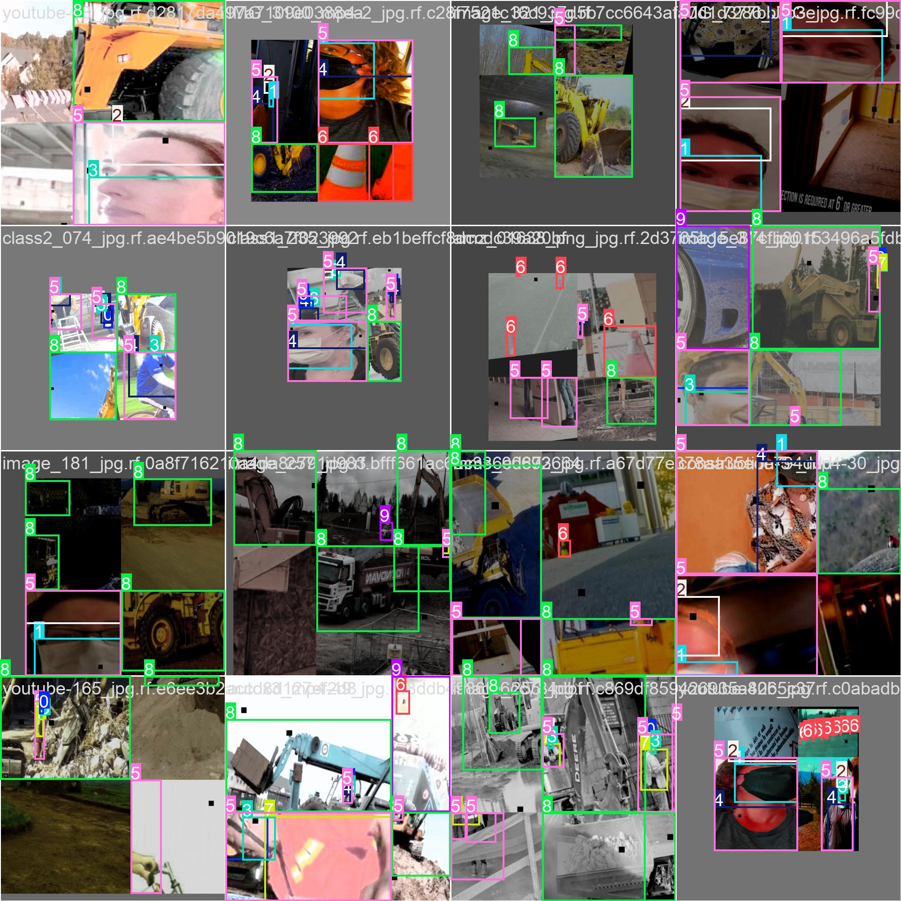
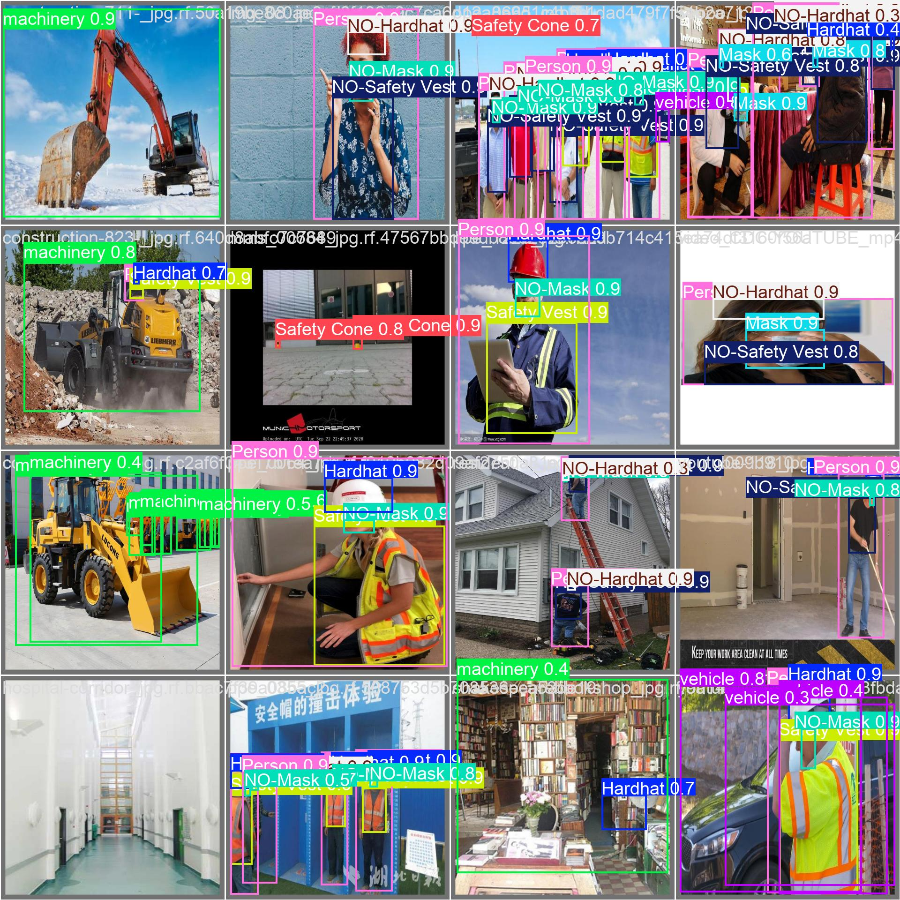
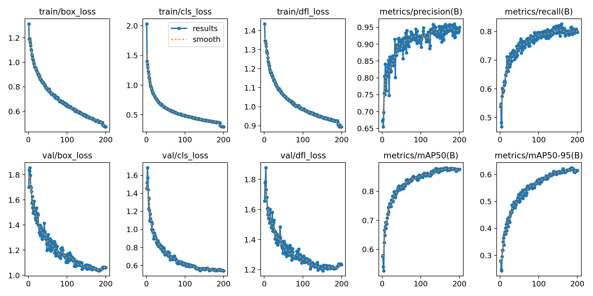

# PPE Detection for Construction Site Safety using YoloV8

> 4,764 workers died on the job in 2020 (3.4 per 100,000 full-time equivalent workers). Workers in transportation and material moving occupations and construction and extraction occupations accounted for nearly half of all fatal occupational injuries (47.4 percent), representing 1,282 and 976 workplace deaths, respectively. 
>
> *Occupational Safety and Health Administration (US Department of Labour)*


## Introduction

### Problem Statement
Construction site safety is a critical concern in the industrial sector. According to the **U.S. Occupational Safety and Health Administration (OSHA)**:
- **4,764 workers** died on the job in 2020 (3.4 per 100,000 full-time equivalent workers)
- **Workers in transportation, material moving, and construction** accounted for nearly **47.4% of fatal occupational injuries**
- **Construction and extraction workers** experienced **976 workplace deaths** in a single year

The primary cause of many preventable injuries and fatalities is **inadequate or improper use of Personal Protective Equipment (PPE)**.

### Solution
This project leverages **state-of-the-art deep learning** with **YoloV8** to automatically detect and verify that construction workers are wearing appropriate PPE in real-time. The system can be deployed as:
- **Automated safety monitoring** on construction sites
- **Real-time alerting** when workers lack proper equipment
- **Compliance reporting** and documentation
- **Risk assessment** for different construction zones

### Dataset
This project utilizes the [**Construction Site Safety Image Dataset**](https://universe.roboflow.com/roboflow-universe-projects/construction-site-safety) provided by Roboflow, a comprehensive collection of annotated construction site images:

- **Total Samples**: 2,801 professionally annotated images
- **Training Set**: 2,605 images for model training
- **Validation Set**: 114 images for performance monitoring
- **Test Set**: 82 images for final evaluation
- **Annotation Format**: YOLO v8 format with normalized bounding box coordinates

### Detectable Classes
The model is trained to detect **10 distinct classes** across construction sites:

| Safety Equipment | Non-Compliance | Scene Objects |
|-----------------|-----------------|---------------|
| **Hardhat** | NO-Hardhat | Person |
| **Mask** | NO-Mask | Vehicle |
| **Safety Vest** | NO-Safety Vest | Machinery |
| **Safety Cone** | - | - |

This multi-class detection enables comprehensive safety monitoring and risk identification.





## Setup

The model was trained on a local machine with an **NVIDIA RTX 5060 Ti (16GB VRAM)**. We utilized the `ultralytics` library by [**Ultralytics**](https://docs.ultralytics.com) to run YoloV8 custom object detection on the dataset.

### Training Configuration
- **Model Architecture**: YoloV8s (Small variant for balanced performance)
- **Total Epochs**: 200
- **Batch Size**: 16
- **Base Learning Rate**: 1e-3
- **Optimizer**: Auto (Adaptive optimizer selection)
- **Training Hardware**: NVIDIA RTX 5060 Ti with 16GB VRAM
- **Training Duration**: Approximately 1.92 hours for 200 epochs

### Key Technologies & Libraries
- **Ultralytics YoloV8**: State-of-the-art real-time object detection framework
- **PyTorch**: Deep learning framework backend
- **OpenCV (cv2)**: Image processing and annotation visualization
- **Pandas & Numpy**: Data manipulation and numerical operations
- **Matplotlib & Seaborn**: Advanced data visualization and training analysis
- **Flask**: Web deployment framework for the detection application

**Note:** This repository contains all results, visualizations, trained models, inference code, and comprehensive deployment infrastructure for production-ready PPE detection.

## Project Structure & Folders

### **Model-Training/** - Training Infrastructure & Dataset

Complete training pipeline with dataset and model artifacts.

#### **Training Notebook:**
- **`yolov8-finetuning-for-ppe-detection.ipynb`** (54 cells)
  - Comprehensive Jupyter notebook implementing the complete training workflow
  - **Data Loading & Preprocessing**:
    - Loads dataset in YOLO format
    - Validates image and label files
    - Creates data.yaml configuration
  - **Model Architecture Setup**:
    - Initializes YoloV8s pre-trained model
    - Configures transfer learning parameters
    - Sets up training hyperparameters
  - **Training Phase**:
    - 200 epochs with batch size of 16
    - Real-time loss and metric monitoring
    - Early stopping patience of 25 epochs
    - Learning rate scheduling with decay
  - **Validation & Evaluation**:
    - Per-epoch validation on 114 images
    - Confusion matrix generation
    - Per-class performance metrics
  - **Visualization & Analysis**:
    - Training curve plots (loss, mAP progression)
    - Sample batch visualization
    - Prediction examples on validation set
    - Performance comparison graphs
  - **Model Export**:
    - Best model checkpointing
    - Final model weights storage

#### **Dataset Organization:**
- **`Dataset/train/`** - Training Set (2605 images)
  - `images/`: JPG format training images from construction sites
  - `labels/`: Corresponding YOLO annotation files (.txt format)
    - Format: `[class_id] [center_x] [center_y] [width] [height]` (normalized coordinates)
    - Contains bounding box information for all PPE objects
  
- **`Dataset/valid/`** - Validation Set (114 images)
  - `images/`: JPG format validation images
  - `labels/`: YOLO format validation annotations
  - Used for monitoring model performance during training
  - Helps detect overfitting
  
- **`Dataset/test/`** - Test Set (82 images)
  - `images/`: JPG format test images
  - `labels/`: YOLO format test annotations
  - Reserved for final model evaluation
  - Represents unseen data for unbiased performance assessment

#### **Training Outputs:**
- **`Outputs/data.yaml`** - Dataset Configuration
  ```yaml
  path: ./Dataset
  train: ./Dataset/train
  val: ./Dataset/valid
  test: ./Dataset/test
  nc: 10
  names: ['Hardhat', 'Mask', 'NO-Hardhat', 'NO-Mask', 'NO-Safety Vest', 
          'Person', 'Safety Cone', 'Safety Vest', 'machinery', 'vehicle']
  ```

- **`Outputs/runs/detect/yolov8s_ppe_css_200_epochs/`** - Training Results
  - `confusion_matrix.png`: Per-class detection accuracy heatmap
  - `results.png`: Loss curves and metric progression across 200 epochs
  - `train_batch*.jpg`: Sample detections from training batches
  - `val_batch*_pred.jpg`: Model predictions on validation set
  - `val_batch*_labels.jpg`: Ground truth labels for reference
  - `results.csv`: Detailed epoch-by-epoch metrics

- **`Outputstraining_log_df.csv`** - Complete Training Log
  - 200 rows (one per epoch) with 15 metrics columns:
    - `epoch`: Training epoch number (1-200)
    - `time`: Cumulative training time
    - `train/box_loss`: Bounding box regression loss
    - `train/cls_loss`: Classification loss
    - `train/dfl_loss`: Distribution focal loss
    - `metrics/precision(B)`: Precision score
    - `metrics/recall(B)`: Recall score
    - `metrics/mAP50(B)`: mAP at 50% IoU threshold
    - `metrics/mAP50-95(B)`: mAP across IoU 50-95%
    - `val/box_loss`: Validation box loss
    - `val/cls_loss`: Validation classification loss
    - `val/dfl_loss`: Validation DFL loss
    - `lr/pg0/pg1/pg2`: Learning rates for parameter groups
  - Enables analysis of training dynamics and convergence

#### **Pre-trained Model Weights:**
- **`yolov8s.pt`** (45.2 MB)
  - Pre-trained YoloV8 Small model on COCO dataset
  - Used as starting point for transfer learning
  - Contains learned feature representations from 80 COCO classes
  
- **`yolo11n.pt`** (Nano variant available)
  - Lighter alternative for edge deployment
  - Can be used for experiments with faster training

### **Model-Deployment/** - Production-Ready Web Application

A comprehensive Flask-based web application for real-time construction site PPE monitoring and compliance tracking.

#### **Core Application Files:**

- **`app.py`** (351 lines)
  - Main Flask application server with SocketIO for real-time communication
  - Implements video streaming routes with WebSocket support for live detection feeds
  - Route handlers include:
    - `/`: Main dashboard with live camera feed
    - `/video_feed`: Video stream endpoint for real-time frame processing
    - `/start_camera`: Start camera capture and detection
    - `/stop_camera`: Stop camera and streaming
    - `/get_stats`: Retrieve real-time detection statistics
    - `/settings`: Display and manage configuration
    - `/update_settings`: Apply new settings
    - `/review`: Historical data review interface
  - Implements threading for non-blocking video capture and processing
  - Handles PPE compliance checking with configurable alerts
  - Real-time statistics emission via WebSocket events
  - Snapshot capture functionality for non-compliance documentation

- **`detection_logic.py`** (237 lines)
  - **InstanceDetector Class**: Core detection logic managing PPE compliance per worker instance
    - Instance tracking with unique serial IDs
    - Configurable PPE requirements (helmet, vest, mask)
    - Non-compliance delay mechanism (prevents false alerts from single frames)
    - Daily serial counter reset for tracking purposes
    - Real-time compliance state management
  - **ComplianceChecker Class**: Validates detected objects against required PPE standards
    - Checks for presence/absence of specific PPE items
    - Generates compliance status reports
    - Calculates compliance percentages
  - **SnapshotManager Class**: Handles snapshot capture and storage
    - Automatic snapshot naming with timestamps
    - Organized storage in `snapshots/` directory
    - Snapshot metadata tracking

- **`database.py`**
  - SQLite database interface for persistent data storage
  - Tables for:
    - Detection history logs
    - PPE compliance records
    - Instance tracking data
    - Alert logs with timestamps
  - Query functions for historical analysis
  - Automatic data persistence across sessions

- **`settings.json`** - Configuration File
  - **`required_ppe`**: Boolean flags for mandatory PPE
    - `helmet`: Hardhat/safety helmet detection (default: true)
    - `vest`: Safety vest detection (default: true)
    - `mask`: Face mask detection (default: true)
  - **`non_compliance_delay`**: Seconds to wait before flagging non-compliance (default: 3s)
    - Prevents false alerts from momentary detection gaps
  - **`instance_reset_timeout`**: Duration in seconds for instance timeout (default: 5s)
    - Worker is considered a new instance if not detected for this duration

- **`instance_counter.json`** - Persistent Counter Storage
  - Tracks daily instance serial numbers
  - Resets automatically at midnight
  - Format: `{"date": "MM_DD_YYYY", "serial": 12345}`

- **`detections.db`** - SQLite Database
  - Persistent storage of all detection events
  - Historical compliance data
  - Alert records with timestamps
  - Enables reporting and compliance auditing

#### **Web Interface Templates:**

- **`templates/index.html`** (619 lines) - Main Dashboard
  - **Live Video Stream**: Real-time camera feed with overlay detection visualization
    - Bounding boxes for detected objects
    - Color-coded annotations (green=compliant, red=non-compliant)
    - Confidence scores display
  - **Detection Statistics Panel**:
    - Real-time counter: Total detections, compliant instances, non-compliant instances
    - Current status indicators with visual alerts
    - Live graph of detection trends
  - **Instance Tracking Display**:
    - Current workers in frame
    - PPE status per worker (helmet, vest, mask)
    - Alert notifications for non-compliance
  - **Control Panel**:
    - Camera start/stop buttons
    - Settings access link
    - Review history link
  - **Real-time Notifications**:
    - WebSocket-powered live updates
    - Audio/visual alerts for compliance violations
    - Timestamp logging of all events
  - **Professional UI Design**:
    - Modern dashboard with Poppins font family
    - Color-coded status indicators (green/red/orange)
    - Responsive design for desktop viewing
    - Clean information hierarchy

- **`templates/settings.html`** (568 lines) - Configuration Interface
  - **PPE Requirements Section**:
    - Toggle switches for each PPE item requirement
    - Real-time validation feedback
    - Apply/save functionality
  - **Detection Parameters**:
    - Non-compliance delay slider (1-10 seconds)
    - Instance timeout configuration
    - Confidence threshold adjustment
  - **System Status**:
    - Current camera status
    - Database information
    - Model loading status
  - **Save Configuration**:
    - Persistent storage to settings.json
    - Validation before saving
    - Success/error notifications
  - **Professional Settings UI**:
    - Organized sections with icons
    - Real-time feedback
    - Form validation

- **`templates/review.html`** - Historical Data Interface
  - Review past detection records
  - Compliance compliance reports

#### **`snapshots/`** - Output Directory
  - Automatically stores timestamped snapshots of non-compliance events
  - Named format: `snapshot_YYYY-MM-DD_HH-MM-SS.jpg`
  - Useful for compliance documentation and incident investigation
  - Linked to database records for easy retrieval

### **Model-Testing/** - Inference Testing & Validation

Standalone scripts for comprehensive model validation and real-world testing without the web interface.

- **`checker.py`** - Hardware checking
  - Usage: `python checker.py`

- **`test_cam.py`** - Real-time Camera Testing
  - Directly accesses system camera for live detection testing
  - Features:
    - Real-time video feed with overlay detection
    - Bounding boxes with class labels and confidence scores
    - Color-coded annotations
  - Usage: `python test_cam.py`

- **`test_single.py`** - Single Image Inference
  - Tests model on individual static images
  - Features:
    - Load image from file path
    - Run inference with confidence thresholds
    - Display results with bounding boxes and labels
    - Debugging detection issues on particular scenarios
  - Usage: `python test_single.py`

### **assets/**
Repository documentation assets:
- Training visualizations, GIFs, and images used in README

### **Root Files**
- **`requirements.txt`**: Python package dependencies (Flask and related libraries)
- **`README.md`**: Project documentation and usage guide
- **`LICENSE`**: Project licensing information
- **`bugs.txt`**: Known issues and bug tracking


## Repository Structure

```
Construction-Site-Safety-PPE-Detection/
├── Model-Training/
│   ├── yolov8-finetuning-for-ppe-detection.ipynb    # Training pipeline notebook
│   ├── Dataset/
│   │   ├── train/
│   │   │   ├── images/                               # 2605 training images
│   │   │   └── labels/                               # YOLO format annotations
│   │   ├── valid/
│   │   │   ├── images/                               # 114 validation images
│   │   │   └── labels/                               # Validation labels
│   │   └── test/
│   │       ├── images/                               # 82 test images
│   │       └── labels/                               # Test labels
│   ├── Outputs/
│   │   ├── data.yaml                                 # Dataset configuration
│   │   └── runs/detect/                              # Training results & plots
│   ├── yolo11n.pt                                    # Pre-trained YoloV8 Nano
│   ├── yolov8s.pt                                    # Pre-trained YoloV8 Small
│   └── Outputstraining_log_df.csv                    # Training metrics log
├── Model-Deployment/
│   ├── app.py                                        # Flask web application
│   ├── detection_logic.py                            # Inference engine
│   ├── database.py                                   # Database operations
│   ├── settings.json                                 # Configuration
│   ├── instance_counter.json                         # Instance tracking
│   ├── templates/
│   │   ├── index.html                                # Main dashboard
│   │   ├── review.html                               # Historical review
│   │   └── settings.html                             # Settings interface
│   └── snapshots/                                    # Detection outputs
├── Model-Testing/
│   ├── checker.py                                    # Hardware Checking
│   ├── test_cam.py                                   # Real-time camera testing
│   └── test_single.py                                # Single image testing
├── assets/                                           # Documentation assets
├── requirements.txt                                  # Dependencies
├── README.md                                         # This file
├── LICENSE                                           # License
└── bugs.txt                                          # Known issues
```

## Training Results & Performance Metrics

### Model Performance (200 Epochs)

The YoloV8s model underwent comprehensive training for **200 epochs** on the construction site safety dataset using an NVIDIA RTX 5060 Ti GPU. The training process completed in approximately **1.92 hours**, demonstrating efficient transfer learning.

#### Final Metrics Achieved:
| Metric | Value |
|--------|-------|
| **Precision** | 0.95 |
| **Recall** | 0.7975 |
| **mAP@50%** | 0.8767 |
| **mAP@50-95%** | 0.6152 |

#### Interpretation:
- **Precision (0.95)**: Of all PPE detections made by the model, 95% are accurate. This indicates the model has excellent reliability in confirming actual PPE when it flags a detection.
- **Recall (0.7975)**: The model identifies approximately 80% of all actual PPE instances in the dataset. This ensures good coverage while maintaining acceptable false negative rates.
- **mAP@50%**: Strong performance at 87.67%, indicating robust detection across all 10 object classes at standard IoU threshold.
- **mAP@50-95%**: Solid performance of 61.52% across stricter IoU thresholds, demonstrating good localization accuracy of bounding boxes.

### Training Characteristics:
- **Data Split**: Train: 2605 images | Valid: 114 images | Test: 82 images
- **Batch Processing**: 16 images per batch
- **Hardware Utilization**: NVIDIA RTX 5060 Ti efficiently processed batches with 16GB VRAM
- **Convergence**: Model achieved plateau around epoch 150-180, with final epochs showing stability
- **Classes Detected**: 10 PPE and non-PPE classes including Hardhat, Mask, Safety Vest, Person, Vehicle, Machinery, etc.

### Visualization Results

#### Confusion Matrix
Shows the model's classification accuracy across all 10 PPE classes:



#### Training Batch Samples
Visual examples of detected PPE during training batches:



#### Validation Batch Predictions
Model predictions on validation set with bounding boxes and confidence scores:



#### Training Curves
Loss and metric progression across all 200 epochs:



## Deployment & Usage

### Web Application
The `Model-Deployment/` directory contains a production-ready Flask web application that provides:
- **Real-time Detection**: Live camera feed processing with instant PPE detection
- **Web Dashboard**: User-friendly interface for monitoring detected instances
- **Configuration Management**: Adjustable detection thresholds and settings
- **Historical Tracking**: Review and analysis of detection history
- **Data Persistence**: Instance counting and data storage capabilities

### Local Testing
Use the testing scripts in `Model-Testing/` to evaluate model performance:
```bash
# Test with camera feed
python Model-Testing/test_cam.py

# Test single image
python Model-Testing/test_single.py

# Hardware Check
python Model-Testing/checker.py
```

### Training Customization
To retrain or fine-tune the model, use the notebook in `Model-Training/`:
```
Model-Training/yolov8-finetuning-for-ppe-detection.ipynb
```

## Dataset Information

**Construction Site Safety Image Dataset** sourced from [Roboflow](https://universe.roboflow.com/roboflow-universe-projects/construction-site-safety):
- **Total Images**: 2,801 annotated images
- **Classes**: 10 categories including PPE and non-PPE objects
- **Annotation Format**: YOLO format with normalized coordinates
- **Diversity**: Wide variety of construction site scenarios, lighting conditions, and worker configurations
- **Quality**: Professional annotations with high inter-rater agreement

## Future Enhancements

1. **Extended Training**: Explore training with additional epochs and learning rate scheduling for marginal performance gains
2. **Multi-Model Ensemble**: Compare and ensemble with YoloV8n, YoloV8m, and YoloV8l variants for improved robustness
3. **Worker Tracking**: Implement DeepSORT or SORT algorithms for individual worker ID tracking across frames
4. **Alert System**: Automated alarm triggering when workers detected without proper PPE
5. **Database Logging**: Persistent storage of PPE violations for compliance reporting
6. **Mobile Deployment**: Convert model to ONNX/TensorFlow Lite for edge device deployment
7. **Performance Optimization**: Model quantization and pruning for faster inference on edge devices
8. **Multi-Camera Support**: Scalable architecture for simultaneous monitoring of multiple camera feeds
